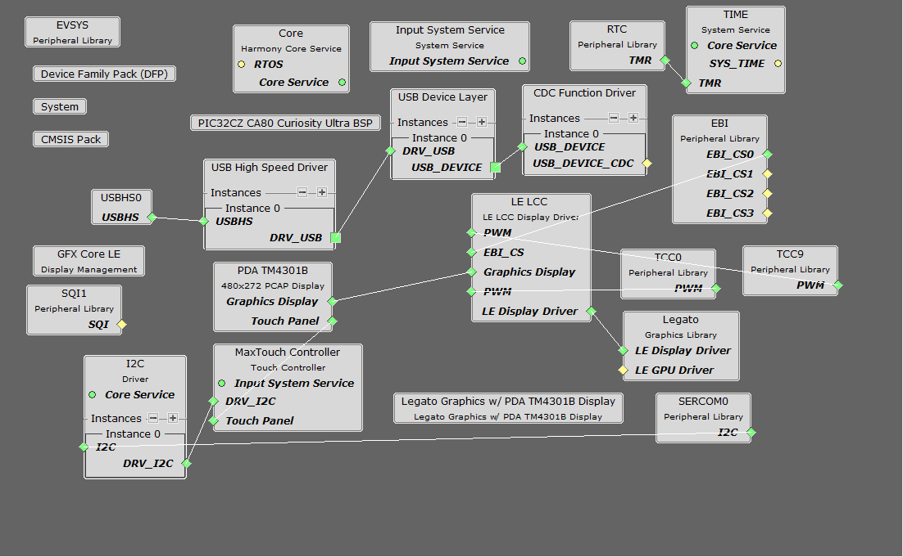
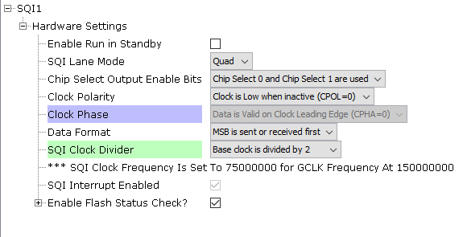
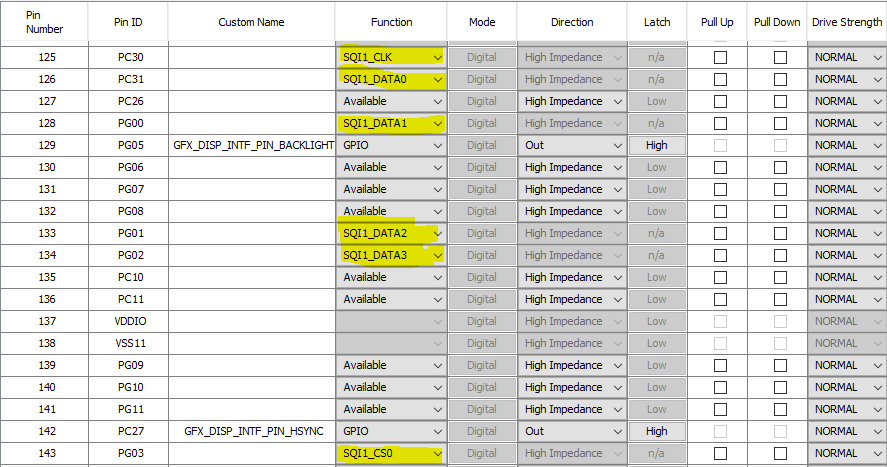
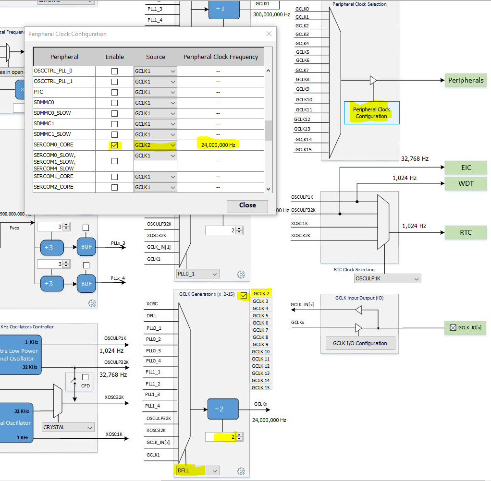
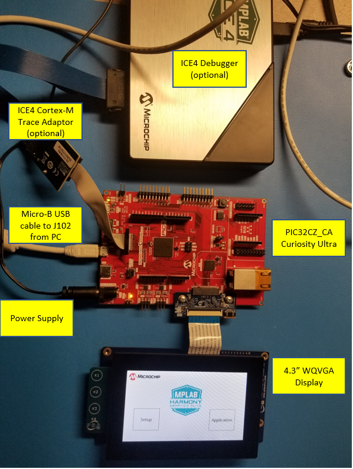
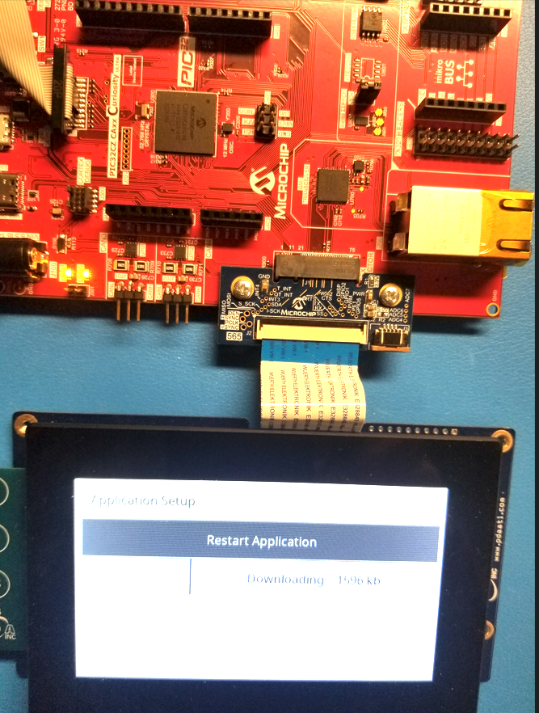
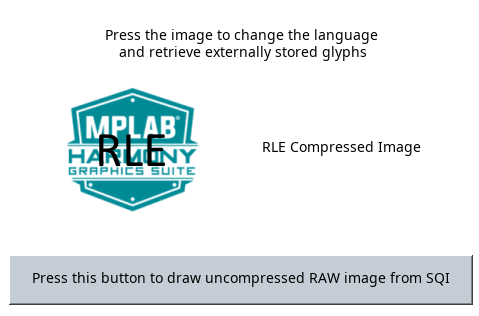

 legato\_x\_r\_cz\_ca80\_cu\_tm4301b.X

Defining the Architecture
-------------------------

The legato_ext_res application uses the USB peripheral in MPLAB Harmony and the USB driver to import a .bin file which contains resources, and then programs that file into the external non-volatile SQI memory. The Graphics Library is used to render graphics to the display. Using the DMA, the Low-Cost Controllerless (LCC) Display Driver continuously transfers frame data from the frame buffer out to the LCD display.

The application also features user touch input through the integrated touch screen on the display panel. Touch input from the touch controller goes through the I2C port, and the Input System Service acquires the touch input information from the Touch and I2C drivers. The Input System Service sends touch events to the Graphics Library, which processes these events and updates the frame data accordingly.

This configuration runs on the PIC32CZ_CAxxx Curiosity Ultra with RGB565 GFX Interface board and WQVGA display. Two frame buffers are stored in the internal SRAM in a double buffer configuration, and the Low-Cost Controllerless (LCC) display driver is used to manage the DMA that transfers the read frame buffer contents to the display via the EBI peripheral. The Legato Graphics Library draws the updated sections of the frame to an internal scratch buffer which is used by the LCC display driver to update the frame buffer.

User touch input on the display panel is received thru the PCAP capacitive touch controller, which sends a notification to the Touch Input Driver. The Touch Input Driver reads the touch information over I2C and sends the touch event to the Graphics Library thru the Input System Service.

The USB peripheral receives a file named SQI.bin through a USB connection to a PC via a serial terminal program client (TeraTerm). The application reads this binary file and writes it to external non-volatile memory via the SQI peripheral.

### Demonstration Features

- Legato Graphics Library
- Input system service and touch driver
- Time system service, timer-counter peripheral library and driver
- Low-Cost Controllerless driver with global palette support
- 16-bit RGB565 color depth
- EBI peripheral library and driver
- I2C peripheral library and driver
- SQI peripheral library
- USB High Speed driver
- Images and Fonts for user interface stored in internal and external NVM memory

Creating the Project Graph
--------------------------

The Project Graph diagram shows the Harmony components that are included in this application. Lines between components are drawn to satisfy components that depend on a capability that another component provides.

Adding the **PIC32CZ_CA80 Curiosity Ultra BSP** and **Legato Graphics w/ PDA TM4301B Display** Graphics Template component into the project graph will automatically add the components needed for a graphics project and resolve their dependencies. It will also configure the pins needed to drive the external peripherals like the display and the touch controller.

Additional components to support USB, SQI, I2C and SERCOM Driver needs to be added and connected manually.

Some of these components are fine with default settings, while other require some changes. The following is a list of all the components that required custom settings.

For SPI Flash, set clock divider to 2.

For SPI Flash access, make sure all 6 pins for QSPI is mapped.

To support SERCOM peripheral for MaxTouch Controller, set the GCLK2 clock to 24MHz as shown.

Building the Application
------------------------

The parent directory for this application is harmony\_gfx\_apps\_pic32cz\_ca\apps\legato\_ext\_res. To build this application, use MPLAB X IDE to open the harmony\_gfx\_apps\_pic32cz\_ca\apps\legato\_ext\_res/firmware/legato\_x\_r\_cz\_ca80\_cu\_tm4301b.X project file.

The following table lists configuration properties:

|Project Name|BSP Used|Graphics Template Used|Description|
|:-----------|:-------|:---------------------|:----------|
|legato\_x\_r\_cz\_ca80\_cu\_tm4301b.X|PIC32CZ_CA Curiosity Ultra|PDA TM4301b Display|PIC32CZ_CAxxx Curiosity Ultra board with PDA TM4301B 480x272 (WQVGA) display|

> \*\*\_NOTE:\_\*\* This application may contain custom code that is marked by the comments // START OF CUSTOM CODE ... and // END OF CUSTOM CODE. When using the MPLAB Harmony Configurator to regenerate the application code, use the "ALL" merging strategy and do not remove or replace the custom code.

Configuring the Hardware
------------------------

The final setup should be:

Configuring the 4.3-inch WQVGA Display requires disconnecting the ribbon cable that connects the display to the interposer board.

First, release the ribbon cable from the interposer board. Next, release the black clamp on the J2 connector and turn the display over. Finally, insert the ribbon cable into J2 and close the clamp.

The board and display are powered by an external power supply connected to J100.

The board can be debug via the on-board EDBG via the **Debug USB** port J200, or by using the ICE4 Debugger and the ICE4 Cortex-M Trace Adapter Board, which are connected as shown above.

Connect the USB cable to the **Target USB** USB micro port J102 from the PC. This can be connected before or at any point after the application is powered-on.

Running the Demonstration
-------------------------

When power-on is successfully the demonstration will display a screen with 2 buttons **Setup** and **Application**:

If a valid USB is connection is made to PC, the LED0 (yellow) will light up.

Press and release the **Setup** button to go to the Setup screen.

Press and release the **Erase & Update SQI Flash** button on-screen. Next press and release the **Yes** button. The application will wait for the the data transfer from the PC on release of the button. 

Next, use your favorite Terminal program on the PC and open a **new connection**.

Now send file **SQI.bin** using the Terminal program from the PC.

LED1, on lower left side of the Curiosity board in the picture, will Light up yellow when the file is flashing successfully. It will then display a downloading progress to indicate the transfer. Now press and release **Restart Application** button after Terminal shows completed. This will take you back to the introduction screen.

Press and release the application button.

Pressing the button will cause the application to load a new image. The image cycles in order from Uncompressed RAW with Direct Blit, Uncompressed RAW, Run-Length Encoded (RLE) RAW, to JPEG.

The MPLAB Harmony Graphics Suite logo is also a button. Pressing the logo will toggle the application between English and Simplified Chinese.

Note that all images and glyphs are retrieved from external NVM via SQI. The application is purposely setup in single-buffer configuration to allow visual inspection of the data retrieval speed of the various images and glyphs.

* * * * *

 
