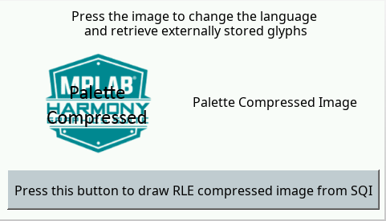
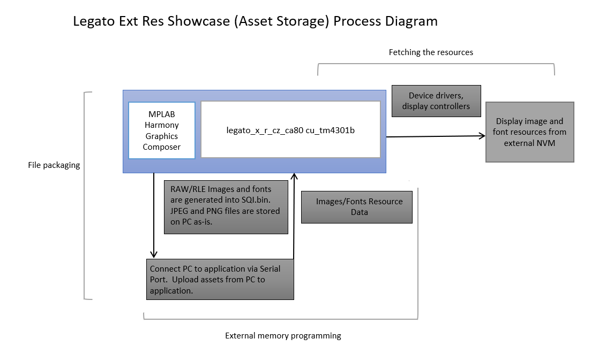

---
parent: Example Applications
title: Legato Flash
nav_order: 4
---

# Legato External Resources

The legato_flash demonstration application serves as an external memory programmer to flash the off-chip non-volatile memory with the resources held on a PC, which can then be accessed and displayed.

This application is used for creating preloaded images/fonts from QSPI flash external non-volatile memory. After the preloaded images/fonts from QSPI flash are created, the file (SQI.bin) must be coppied onto external QSPI flash for legato_flash use.

This application then displays the various images, strings, and fonts previously stored on QSPI flash external and internal non-volatile memory.

The following figure shows the external resources process diagram

This demonstration runs on:

|MPLABX Configuration|Board Configuration|
|:-------------------|:------------------|
|[legato_x_r_cz_ca80_cu_tm4301b.X](./firmware/legato_x_r_cz_ca80_cu_tm4301b.X/readme.md)|PIC32CZ_CA Curiosity Ultra Kit using LCC MCU DMA graphics controller to drive the [High-Performance WQVGA Display Module with maXTouch® Technology](https://www.microchip.com/DevelopmentTools/ProductDetails/PartNO/AC320005-4)|

 
